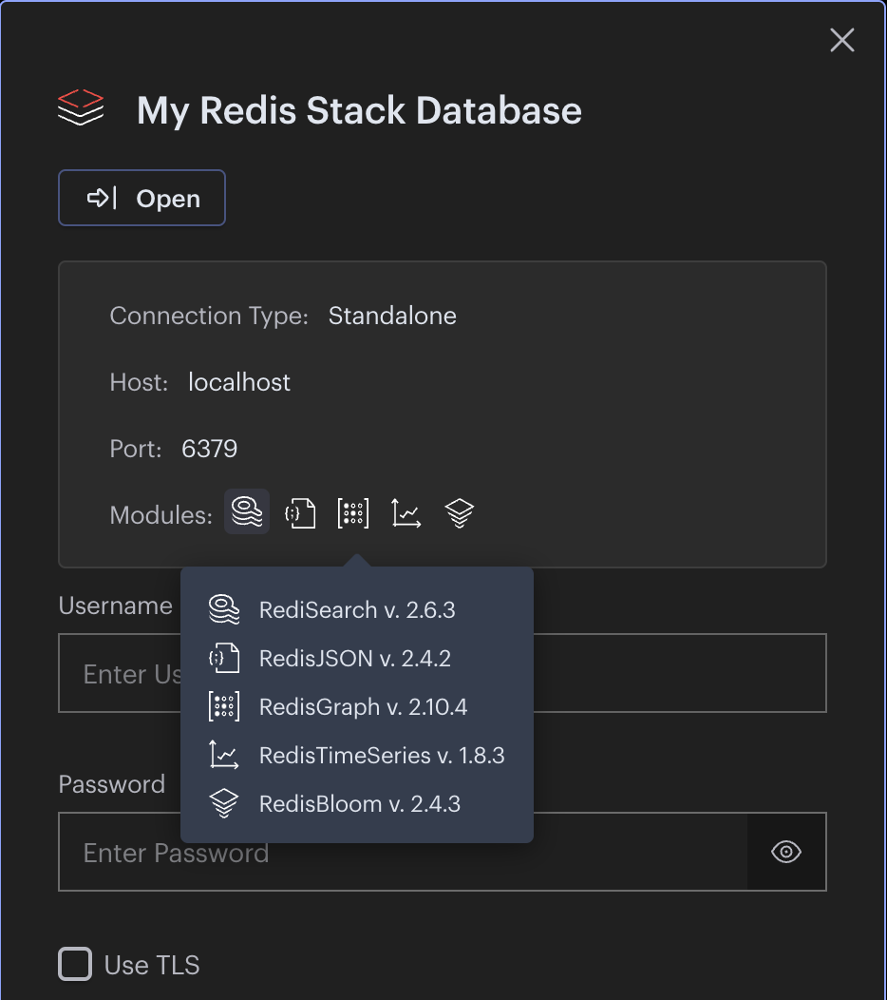

Redis Demo with Redis Stack
===============================

RedisInsight: a visualization tool for understanding and optimizing Redis data.

# Modules

* RedisJSON
* RediSearch 
* RedisGraph
* RedisTimeSeries
* RedisBloom

# References
       
* Redis Stack: https://redis.io/docs/stack/ https://github.com/redis-stack/redis-stack
* Hello, Redis Stack: https://redis.com/blog/introducing-redis-stack/
* Redis Streams: https://redis.io/topics/streams-intro
* A first look at Redis Streams and how to use them with Java: https://www.javacodegeeks.com/2018/05/a-first-look-at-redis-streams-and-how-to-use-them-with-java.html
* Spring Data Redis: https://docs.spring.io/spring-data/redis/docs/current/reference/html/
* https://github.com/lettuce-io/lettuce-core/wiki/Reactive-API-(5.0)
* Redis Enterprise: https://hub.docker.com/r/redislabs/redis

